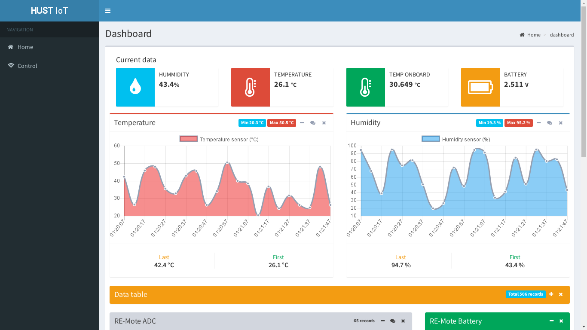

# OM2M front end web client 

This project was generated with [Angular CLI](https://github.com/angular/angular-cli) version 1.1.3.

## Backend OM2M

- Download backend at [OM2M](https://github.com/giatuyentiensinh/OM2M) (Require jdk >= 1.7)
- Extract .zip file and start Server with command `sh start.sh` in each folder.

  ```
  $ unzip IN-CSE.zip && unzip MN-CSE.zip
  $ cd IN-CSE && sh start.sh
  $ cd MN-CSE && sh start.sh
  ```

## Development server

Open terminal and typing `npm start` for starting project. Afterward, open browser and access `http://localhost:4200`.

## Code scaffolding

Run `ng generate component component-name` to generate a new component. You can also use `ng generate directive|pipe|service|class|module`.

## Build

Run `ng build` to build the project. The build artifacts will be stored in the `dist/` directory. Use the `-prod` flag for a production build. 

Or you and run `npm build {path}`.

e.g: `npm build {OM2M_PATH}/org.eclipse.om2m.webapp.resourcesbrowser.ui/src/main/resources/webapps/`

## Demo



# Auth: Tuyenng
